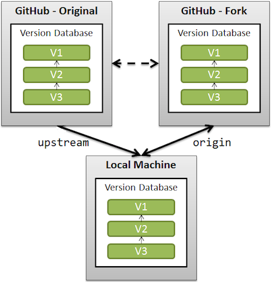

# Repository Synchronization Instructions

[](https://stackoverflow.com/a/24844659)

## Description

This document serves as a guide for those who have manually cloned the repository and created a separate repository in their GitHub accounts to manage their contributions.
This repository is not a `fork` in the strict GitHub sense, but the process for keeping your repository in sync with the original repository is similar.

By following these instructions, you can make sure that your local copy is updated with your remote copy and also keep up to date with the latest changes to the main repository. This process is crucial for an efficient collaborative workflow and to avoid merge conflicts.

## Configuration

Proper management of remotes in Git is critical for collaboration in open source projects and team environments. In this case, we will work with two remotes:

- `origin`: Your fork on GitHub where you can upload your own changes.  
[https://github.com/beatrizsmerino/vue-certification-bootcamp-level-1/branches](https://github.com/beatrizsmerino/vue-certification-bootcamp-level-1/branches)
- `upstream`: The original repository from which you have forked.  
[https://github.com/Vuejs-Certification/bootcamp-level-1/branches](https://github.com/Vuejs-Certification/bootcamp-level-1/branches)

### Steps

Below are the steps to set up these remotes and synchronize your repository:

1. Open the terminal or command line.

2. Navigate to your local repository with the `cd` command:

3. Add the original repository as a remote (if you have not already done so) with the name `upstream`:

```bash
git remote add upstream https://github.com/Vuejs-Certification/bootcamp-level-1.git
```

4. Fetch branch information and other data from the remote `upstream`:

```bash
git fetch upstream
```

5. Verify that the remote has been added correctly and that the branches are listed:

```bash
git remote -v
```

6. Pull the specific branch you want from `upstream`. For example, if you want to pull the `main` branch:

```bash
git pull upstream main
```

7. If your local `main` branch is not up to date or you want to merge it with `upstream/main`, use:

```bash
git checkout main
git merge upstream/main
```
